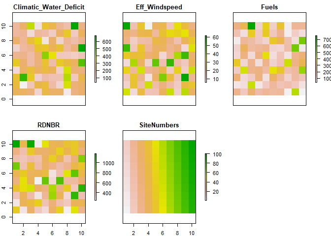
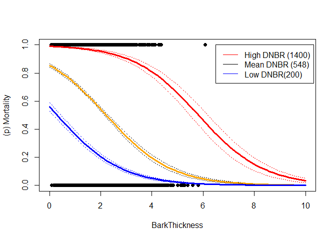
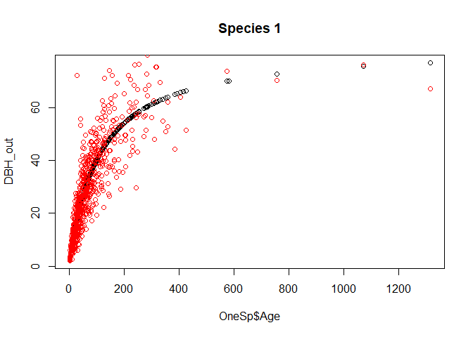
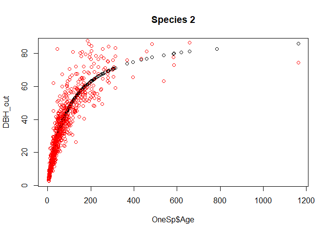
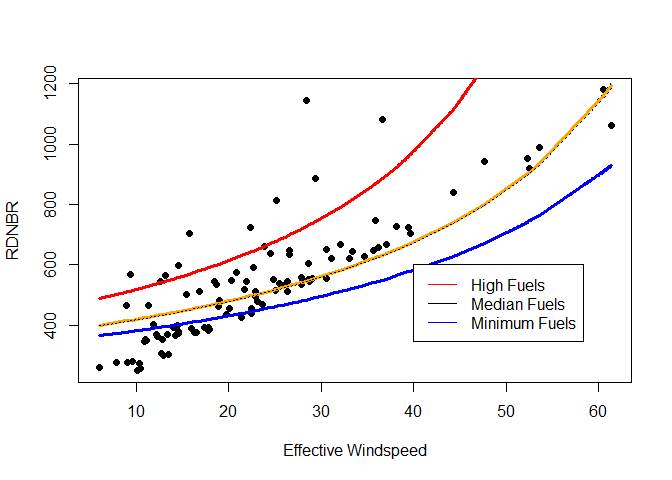

R Notebook
================

# 

This the code provides a simple example of how to assimilate feild and
remote sensing data to create inputs for the Scrpple mortality model.
Please raise an issue on this github page if you have corrections or
questions. No warranty on parameters. This is only to serve as a
educational tool

ZJ Robbins 2021 \#\#\#\#\#\#\#\#\#\#\#\#\#\#

### Feild data

Here we have feild data for three species, across 100 sites. This
includes the estimated Age, DBH and whether the tree was dead. We have
included here an emperical constant for the relationship between bark
thickness and DBH (BT\_coeff). This is used to calculate the column
Bark.

``` r
library(raster)
```

    ## Loading required package: sp

``` r
FD_write<-read.csv('Practice_Data/PracticeData.csv')
head(FD_write)
```

    ##   X SiteNumbers Species Age BT_coeff       DBH Dead
    ## 1 1           1       3  49    0.052 31.692879    1
    ## 2 2           1       3 227    0.052 82.760891    0
    ## 3 3           1       3  36    0.052 24.433720    0
    ## 4 4           1       1  10    0.028  6.295774    1
    ## 5 5           1       2  89    0.049 60.262363    0
    ## 6 6           1       3 218    0.052 69.933239    0

``` r
FD_write$Bark<-FD_write$BT_coeff*FD_write$DBH
```

### Raster data

We also have (example) rasters for the area of these sites. These
include the previous years climatic water deficit, the effective wind
speed on the day of,estimations of fuels, and the post fire RDNBR. These
are constructed into a dataframe and joined with the plot level data by
site name. Note: Here every site represents a pixel in the feild, this
will have to be adjusted to fit data coverage.

``` r
Rasters<-stack(paste0("Practice_Data/",list.files("Practice_Data/",pattern="\\.tif$")))
plot(Rasters)
```

<!-- -->

``` r
R_df<-as.data.frame(Rasters)
TestingSet<-merge(FD_write,R_df,by="SiteNumbers",all.x=T)
```

### Fitting the individual level mortality

``` r
glm1<-with(TestingSet,glm(Dead~Bark+RDNBR,family="binomial"))  
summary(glm1)  
```

    ## 
    ## Call:
    ## glm(formula = Dead ~ Bark + RDNBR, family = "binomial")
    ## 
    ## Deviance Residuals: 
    ##     Min       1Q   Median       3Q      Max  
    ## -2.4822  -0.9792   0.5203   0.9024   2.2699  
    ## 
    ## Coefficients:
    ##               Estimate Std. Error z value Pr(>|z|)    
    ## (Intercept) -0.6403643  0.1756475  -3.646 0.000267 ***
    ## Bark        -0.7944687  0.0534689 -14.859  < 2e-16 ***
    ## RDNBR        0.0043865  0.0003283  13.359  < 2e-16 ***
    ## ---
    ## Signif. codes:  0 '***' 0.001 '**' 0.01 '*' 0.05 '.' 0.1 ' ' 1
    ## 
    ## (Dispersion parameter for binomial family taken to be 1)
    ## 
    ##     Null deviance: 2692.9  on 1999  degrees of freedom
    ## Residual deviance: 2230.7  on 1997  degrees of freedom
    ## AIC: 2236.7
    ## 
    ## Number of Fisher Scoring iterations: 4

We see here both Bark thickness and RDNBR are predictive of the
indivdual cohort mortality.

Lets look at that relationship.

``` r
BarkThickness<-seq(0,10,.1)


ysim_LowFlame<-predict(glm1,
                       data.frame(Bark =BarkThickness,RDNBR=(rep(200,length(BarkThickness)))) ,
                       type="response",se=T)
ysim_MedianFlame<-predict(glm1,
                          data.frame(Bark = BarkThickness,RDNBR=rep(548,length(BarkThickness))) ,
                          type="response",se=T)
ysim_MaxFlame<-predict(glm1,
                       data.frame(Bark = BarkThickness,RDNBR=rep(max(1200,na.rm = T),length(BarkThickness))),
                       type="response",se=T)

### Plotting the model 
plot(FD_write$Bark,FD_write$Dead,  pch = 16, xlab = "BarkThickness", ylab = "(p) Mortality",
     ylim=c(0,1.0),xlim=c(0,10))

#lines(newdata3$LL,col="blue",lwd=3.0,lty=3.0)
lines(BarkThickness,ysim_MedianFlame$fit+ysim_MedianFlame$se.fit,col="black",lwd=1.0,lty=3.0)
lines(BarkThickness,ysim_MedianFlame$fit,col="orange",lwd=3.0)
lines(BarkThickness,ysim_MedianFlame$fit-ysim_MedianFlame$se.fit,col="black",lwd=1.0,lty=3.0)
#lines(BarkThickness,ysim_D,col="orange",lwd=3.0)
lines(BarkThickness,ysim_MaxFlame$fit+ysim_MaxFlame$se.fit,col="red",lwd=1.0,lty=3.0)
lines(BarkThickness,ysim_MaxFlame$fit,col="red",lwd=3.0)
lines(BarkThickness,ysim_MaxFlame$fit-ysim_MaxFlame$se.fit,col="red",lwd=1.0,lty=3.0)

lines(BarkThickness,ysim_LowFlame$fit+ysim_LowFlame$se.fit,col="blue",lwd=1.0,lty=3.0)
lines(BarkThickness,ysim_LowFlame$fit,col="blue",lwd=3.0)
lines(BarkThickness,ysim_LowFlame$fit-ysim_LowFlame$se.fit,col="blue",lwd=1.0,lty=3.0)
legend(6.5,1.0,legend=c("High DNBR (1400)","Mean DNBR (548)","Low DNBR(200)"),lty=c(1,1,1),col=c("red","black","blue")) 
```

<!-- -->

### Fitting DBHAge and Maximum Bark coefficents.

This section estimates the parameters for DBHAge and Maximum Bark
thickness, used at the species level to relate age to dbh to bark
thickness.

``` r
FitDBHfunction<-function(Age,par,Obs){
  DBH_out<-(par[1]*Age)/(Age+par[2])
  return(-sum(dnorm(DBH_out,mean=Obs,sd=3,log=TRUE)))
}
#?optim
DF<-NULL

for( i in unique(FD_write$Species)){
  OneSp<-FD_write[FD_write$Species==i,]
  
  
  opt1=optim(c(60,400),f=FitDBHfunction,
                Age=as.numeric(OneSp$Age),
                Obs=as.numeric(OneSp$DBH))
  
  par1<-as.numeric(opt1$par[1])
  par2<-as.numeric(opt1$par[2])
  #par2<-400
  DBH_out<-(par1*OneSp$Age)/(OneSp$Age+par2)
  plot(OneSp$Age,DBH_out,main=paste0("Species ",i))
  points(OneSp$Age,OneSp$DBH,col="red")
  MaxBark<-par1*OneSp$BT_coeff
  
  score<-summary(lm(DBH_out~OneSp$DBH))$r.squared
  OutRow<-data.frame(Spp=i,
                     maxDBH=par2,MaxBark=MaxBark[1],score=score)
  DF<-rbind(OutRow,DF)
}
```

<!-- --><!-- --><!-- -->

``` r
print(DF)
```

    ##   Spp    maxDBH  MaxBark     score
    ## 1   2  94.64904 4.553223 0.8346437
    ## 2   1 107.44713 2.326237 0.7815938
    ## 3   3  99.12625 5.609775 0.8788746

### Fitting site level mortlaity

Here we fit the site level mortality, for this study we are using RDNBR
as the measure of that. We test that against the effective windspeed,
fuels, and climatic water deficit

``` r
glm2<-with(TestingSet,glm(RDNBR~Eff_Windspeed+Fuels+Climatic_Water_Deficit))
summary(glm2)
```

    ## 
    ## Call:
    ## glm(formula = RDNBR ~ Eff_Windspeed + Fuels + Climatic_Water_Deficit)
    ## 
    ## Deviance Residuals: 
    ##      Min        1Q    Median        3Q       Max  
    ## -230.423   -14.735     4.784    18.536   130.182  
    ## 
    ## Coefficients:
    ##                         Estimate Std. Error t value Pr(>|t|)    
    ## (Intercept)            68.592943   3.570643  19.210   <2e-16 ***
    ## Eff_Windspeed          15.047521   0.092446 162.772   <2e-16 ***
    ## Fuels                   0.689426   0.008716  79.097   <2e-16 ***
    ## Climatic_Water_Deficit -0.006007   0.009111  -0.659     0.51    
    ## ---
    ## Signif. codes:  0 '***' 0.001 '**' 0.01 '*' 0.05 '.' 0.1 ' ' 1
    ## 
    ## (Dispersion parameter for gaussian family taken to be 2414.999)
    ## 
    ##     Null deviance: 79382737  on 1999  degrees of freedom
    ## Residual deviance:  4820338  on 1996  degrees of freedom
    ## AIC: 21261
    ## 
    ## Number of Fisher Scoring iterations: 2

It seems there is no relationship with climatic water deficit.We can
refit the model without it.

``` r
glm3<-with(TestingSet,glm(RDNBR~Eff_Windspeed+Fuels))
summary(glm3)
```

    ## 
    ## Call:
    ## glm(formula = RDNBR ~ Eff_Windspeed + Fuels)
    ## 
    ## Deviance Residuals: 
    ##      Min        1Q    Median        3Q       Max  
    ## -230.195   -15.790     4.442    19.143   129.221  
    ## 
    ## Coefficients:
    ##                Estimate Std. Error t value Pr(>|t|)    
    ## (Intercept)   67.324847   3.007829   22.38   <2e-16 ***
    ## Eff_Windspeed 15.048738   0.092414  162.84   <2e-16 ***
    ## Fuels          0.689148   0.008705   79.17   <2e-16 ***
    ## ---
    ## Signif. codes:  0 '***' 0.001 '**' 0.01 '*' 0.05 '.' 0.1 ' ' 1
    ## 
    ## (Dispersion parameter for gaussian family taken to be 2414.315)
    ## 
    ##     Null deviance: 79382737  on 1999  degrees of freedom
    ## Residual deviance:  4821387  on 1997  degrees of freedom
    ## AIC: 21259
    ## 
    ## Number of Fisher Scoring iterations: 2

Lets take a look of that relationship.

``` r
### Plotting the model 
ysim_No<-with(TestingSet,predict(glm3,
                      data.frame(Eff_Windspeed = Eff_Windspeed,Fuels=(rep(0,length(Eff_Windspeed)))) ,
                      type="response",se=T))
ysim_Median<-with(TestingSet,predict(glm3,
                 data.frame(Eff_Windspeed = Eff_Windspeed,Fuels=(rep(median(Fuels),length(Eff_Windspeed)))) ,
                 type="response",se=T))
ysim_Max<-with(TestingSet,predict(glm3,
                     data.frame(Eff_Windspeed = Eff_Windspeed,Fuels=(rep(max(Fuels),length(Eff_Windspeed)))) ,
                     type="response",se=T))


plot(TestingSet$Eff_Windspeed,TestingSet$RDNBR,  pch = 16, xlab = "Effective Windspeed", ylab = "RDNBR")
lines(TestingSet$Eff_Windspeed,ysim_Median$fit+ysim_Median$se.fit,col="black",lwd=1.0,lty=3.0)
lines(TestingSet$Eff_Windspeed,ysim_Median$fit,col="orange",lwd=3.0)
lines(TestingSet$Eff_Windspeed,ysim_Median$fit-ysim_Median$se.fit,col="black",lwd=1.0,lty=3.0)
lines(TestingSet$Eff_Windspeed,ysim_Max$fit+ysim_Max$se.fit,col="red",lwd=1.0,lty=3.0)
lines(TestingSet$Eff_Windspeed,ysim_Max$fit,col="red",lwd=3.0)
lines(TestingSet$Eff_Windspeed,ysim_Max$fit-ysim_Max$se.fit,col="red",lwd=1.0,lty=3.0)
lines(TestingSet$Eff_Windspeed,ysim_No$fit+ysim_No$se.fit,col="blue",lwd=1.0,lty=3.0)
lines(TestingSet$Eff_Windspeed,ysim_No$fit,col="blue",lwd=3.0)
lines(TestingSet$Eff_Windspeed,ysim_No$fit-ysim_No$se.fit,col="blue",lwd=1.0,lty=3.0)
legend(40,600.0,legend=c("Maximum Fuels","Median Fuels","Minimum Fuels"),
       lty=c(1,1,1),col=c("red","black","blue")) 
```

<!-- -->

This analysis provides us with the following parameters.

  - SiteMortalityB0 68.592943 \<\< Intercept

  - SiteMortalityB1 0.00 \<\< The parameter fit for site level clay % in
    Soil.

  - SiteMortalityB2 0.00 \<\< The parameter fit for site level previous
    years annual ET.

  - SiteMortalityB3 15.047521 \<\< The parameter fit for site level
    Effective Windspeed.

  - SiteMortalityB4 0.00.0 \<\< The parameter fit for site level
    Climatic Water Deficit (PET-AET).

  - SiteMortalityB5 0.689426 \<\< The parameter fit for fine fuels.

  - SiteMortalityB6 0.0 \<\< The parameter fit for ladder fuels.

  - CohortMortalityB0 -.6403

  - CohortMortalityB1 -0.7945 \<\< The parameter fit for the
    relationship between bark thickness and cohort mortality.

  - CohortMortalityB2 0.0043685 \<\< The parameter fit for the
    relationship between site mortality and cohort mortality.

We also have the parameters AgeDBH, MaximumBarkThickness for the three
species these can be inserted in the SCRPPL\_Spp\_Table.csv (in DF)
